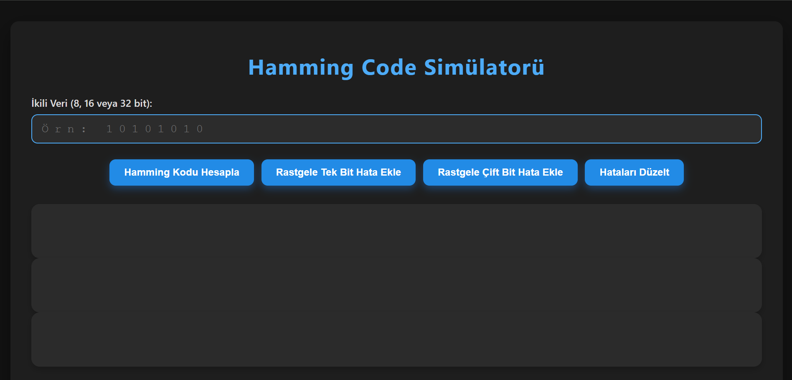
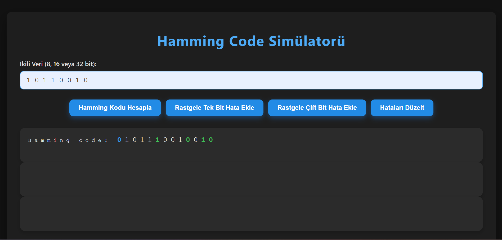
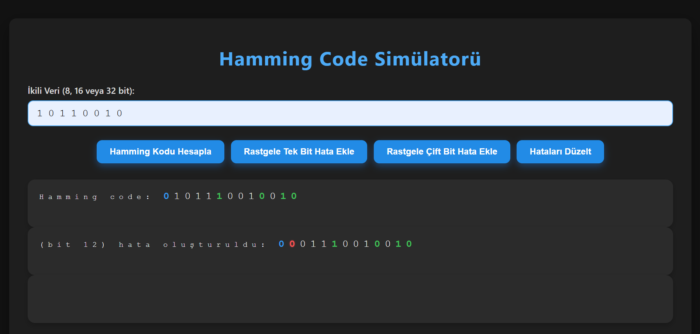
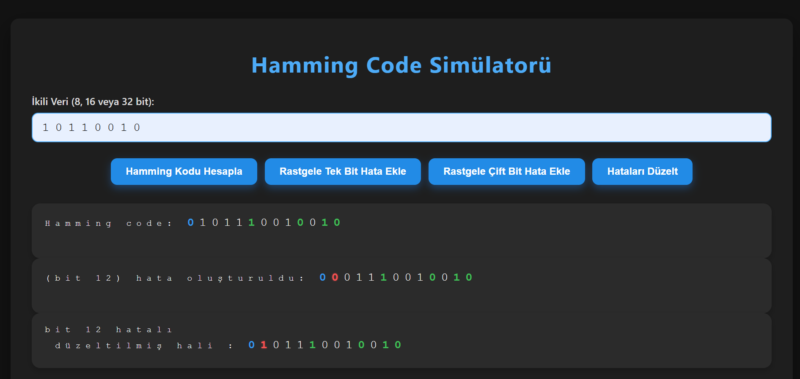
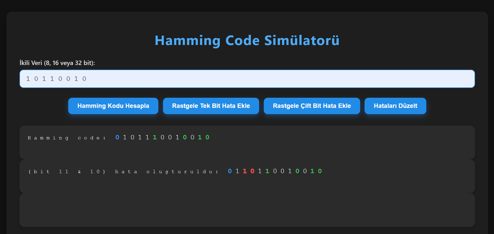
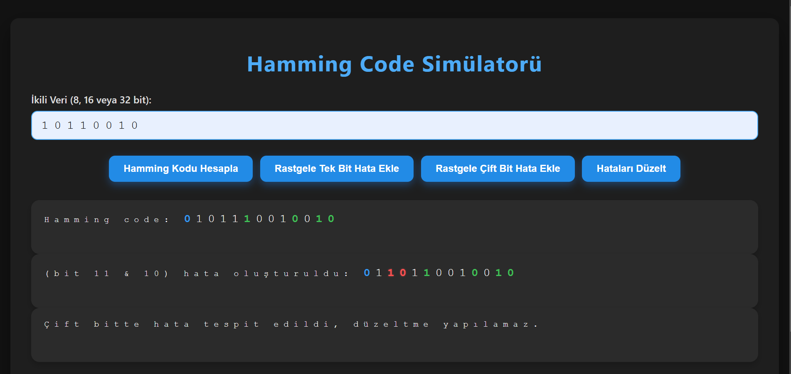

# 🧮 Hamming Code Simülatörü

Bu proje, **Hamming SEC-DED (Single Error Correction, Double Error Detection)** kodlama mantığını görselleştirerek kullanıcıların ikili veriler (binary data) üzerinden tek ve çift bit hatalarını simüle edip düzeltmesini sağlar.

[Projenin demo videosunu izlemek için tıklayabilirsiniz](https://www.youtube.com/watch?v=BmD_1Q-258Y)

## 🚀 Özellikler

- ✅ 8, 16 veya 32 bitlik ikili veri girişi  
- 🧠 Hamming kodu (SEC-DED) üretimi  
- 🔁 Rastgele tek bit veya çift bit hata enjeksiyonu  
- 🔍 Hata tespiti ve düzeltme simülasyonu  
- 🎨 Renkli ve kullanıcı dostu arayüz  
- 📱 Mobil uyumlu tasarım  

## 📸 Arayüz Özeti
 Giriş ekranı
 
   

- **Veri Girişi:** Kullanıcı 8, 16 veya 32 bitlik ikili veri girer.
- **Butonlar:**
  - `Hamming Kodu Hesapla`: Girilen veriye uygun Hamming kodu oluşturur.
  - `Rastgele Tek Bit Hata Ekle`: Kod üzerinde rastgele bir bit hatası oluşturur.
  - `Rastgele Çift Bit Hata Ekle`: Kod üzerinde iki farklı bitte hata oluşturur.
  - `Hataları Düzelt`: Oluşan hataları analiz eder ve uygun şekilde düzeltir.
- **Çıktılar:**
  - Hamming kodu (renkli ve işaretli)
    
      

  -  Tek biti hatalı kod

      
   -  Tek biti hatalı kodda düzelt butonuna basıldıktan sonra

      
   -  Çift biti hatalı kod

      
    -  Çift biti hatalı kodda düzelt butonuna basıldıktan sonra
      

        

    

## 📁 Dosya Yapısı

Tek bir HTML dosyasında hem arayüz hem de tüm işlevsellik entegredir:

- `HTML`: Form, butonlar ve çıktı kutuları
- `CSS`: Modern ve responsive stil (mobil uyumlu)
- `JavaScript`: Hamming kodlama, hata enjeksiyonu, tespit ve düzeltme

## 📌 Teknik Detaylar

- **Parity Bitleri:** Pozisyonları 2'nin kuvveti olan bitlerdir (1, 2, 4, 8, ...).
- **İkincil Parity (SEC-DED):** Kodun en sonunda yer alır, tek/çift hata ayrımı sağlar.
- **Bitler Sağdan Sola** okunur (en düşük index en sağdaki biti temsil eder).
- **Renk Kodlaması:**
  - 🟢 **Parity Bit**: Yeşil
  - 🔵 **İkincil Parity Bit**: Mavi
  - 🔴 **Hatalı Bit**: Kırmızı

## 🛠 Kullanım

1. Sayfayı tarayıcınızda açmak için --> https://samierz.github.io/Hamming-Code-Simulator/
2. Veri alanına 8, 16 veya 32 bitlik bir ikili sayı girin.
3. "Hamming Kodu Hesapla" butonuna basın.
4. Ardından tek veya çift hata ekleyerek sistemi test edin.
5. "Hataları Düzelt" ile simülasyonu tamamlayın.

